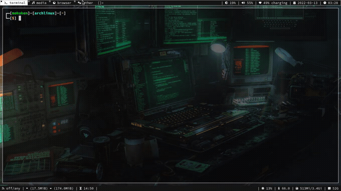

# upmenu
upload files using dmenu

# this is how upmenu works

# features upmenu have and what you can do!
1. browse files to their location.
2. recieve a notification once uploaded.
3. automatically copy the link to clipboard.
4. check the links of files uploaded recently.
5. bind to keyboard shorcut to open it anyhere without opening a terminal.

# you need this dependencies!
1. dmenu
2. xclip
3. dunst or (any notifacation daemon)
4. grep
5. curl
6. awk

